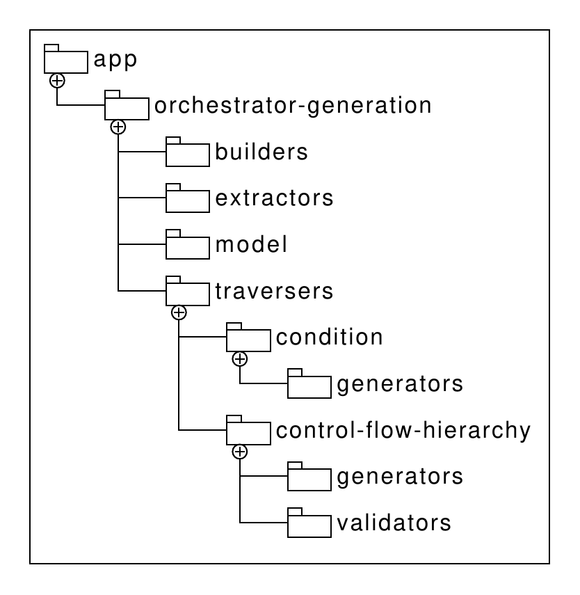

# BPMN4FO
The BPMN for Function Orchestration (BPMN4FO) prototype enables users to model serverless function orchestration models using BPMN (formerly called MaToSWo).
Serverless function orchestration models are then used to generate corresponding orchestrator-specific function orchestration models, making use of platform-specific serverless function orchestration constructs, for the supported function orchestrators.
Currently, BPMN4FO supports four orchestrators:
* Step Functions (Amazon Web Services)
* Durable Functions (Microsoft Azure)
* Apache Openwhisk Composer for orchestrating functions on Apache Openwhisk
* IBM Composer (based on Apache Openwhisk Composer) for orchestrating functions on IBM Cloud Functions

BPMN4FO makes the generated workflow definitions available for download as a zip archive, right beneath the modeling area of the user interface.

## Prerequisites and Setup
* NodeJS, tested with v12.19.0
* Clone this repository
* Navigate to the main folder, containing `package.json`
* Run `npm install`
* Run `npm run dev` to start a local development server at port `9013`, and serve the BPMN4FO prototype
* To execute the tests, run `npm run test`

## Application Structure
The BPMN4FO makes use of `bpmn-js` for modeling the BPMN function orchestrations graphically.
This functionality consists of a graphical BPMN editor and related functions, such as model import and export as `xml` files.
Since BPMN4FO uses customized BPMN elements with additional properties, `bpmn-js` is extended to accommodate this.
The `app/descriptors` and `app/provider` folders contain these customizations.

`bpmn-js` is set up via in the top-level `app/index.html` and `app/index.js` files.
The function orchestrations modeled in the user interface's modeling area can be transformed into the orchestrator-specific models with the help of the `app/orchestrator-generation/BpmnModelOrchestratorTransformation` class, invoked by the user interface.

The components of BPMN4FO are each separated into their own folders.

The `orchestrator-generation/extractors` component is invoked first with the user-created BPMN model as input.
The model is then converted into a simplified version, where each supported model element is handled separately.

This simplified model is handed to the `orchestrator-generation/builders` component, which builds a control flow hierarchy from it.
The control flow hierarchy is defined in the `orchestrator-generation/model` component and represents the control flow structure of the modeled function orchestration.
The control flow hierarchy has separate classes for each supported control flow construct and allows nesting them within each other to create a tree-like structure.

This control flow hierarchy is then traversed by the `traversers/control-flow-hierarchy` component.
The `traversers/control-flow-hierarchy/validators` component validates the control flow hierarchy and the `traversers/control-flow-hierarchy/generators` component generates the orchestrator-specific models from it.
For this they make use of the `traversers/condition/generators` component to generate conditional expressions used in the function orchestration models.

The generated function orchestration models are then made available as `.zip` archive to the user.

## License
The project license is [Apache License 2.0](LICENSE).

Initialization code for the [bpmn-js](https://github.com/bpmn-io/bpmn-js) library and the user interface is based on the code from the [properties-panel-extension](https://github.com/bpmn-io/bpmn-js-examples/tree/master/properties-panel-extension) example project.
